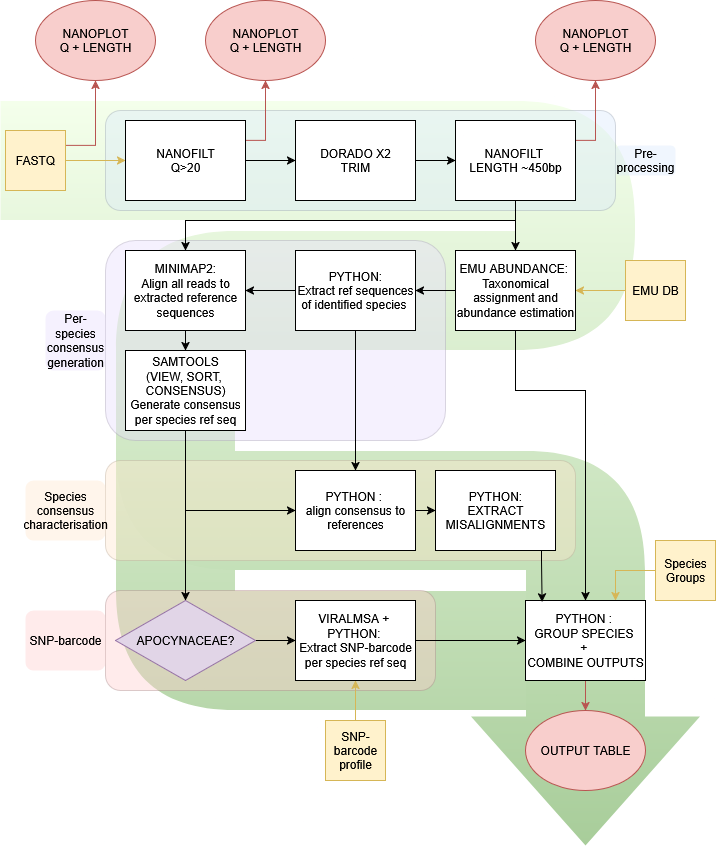

# EMU-based ITS2 plant metabarcoding pipeline 

The EMU-based ITS2 plant metabarcoding pipeline is a taxonomic classification pipeline using ONT data, that performs pre-processing of ONT reads and filtering of EMU taxonomical classification output. Briefly, it:

- trims and filters reads based on expected amplicon length and average phred score
- performs taxonomic classification using [EMU](https://pmc.ncbi.nlm.nih.gov/articles/PMC9939874/)
- Filters reported species based on abundance, median read assignment probability (generated by EMU), number of differences between reference and read-based consensus sequences of reported species and read depth after realignment to reported species reference sequences
- performs SNP-barcode based annotation for species of the Apocynaceae family

**Note**: This software is under active development. If you need any assistance to use or adapt it, feel free to contact the lead developer. 



## Installation

Dependencies:
- [conda](https://anaconda.org/anaconda/conda)
- [EMU 3.5.1](https://github.com/treangenlab/emu)
- [minimap2 2.17](https://github.com/lh3/minimap2)
- [samtools 1.21](https://www.htslib.org/)
- [python 3.10](https://www.python.org/)
- [ViralMSA](https://github.com/niemasd/ViralMSA)
- [nanoplot](https://github.com/wdecoster/nanoplot)
- [virtualenv](https://virtualenv.pypa.io/en/latest/)
- [pip](https://pypi.org/project/pip/)


To install, first download the repository and navigate to the directory. 


```bash
git clone https://github.com/BioinformaticsPlatformWIV-ISP/EMU_plant_ITS2_metabarcoding.git
cd EMU_plant_ITS2_metabarcoding/
```

Create a virtual environment and install python dependencies:
```bash
virtualenv virt_env --python=python3.10;
. virt_env/bin/activate;
pip install -r ./resources/requirements.txt 
```

Extract the database items if needed:
```bash
cd ./database/
gzip -d ./*.gz
mkdir refseqs
python3 deploy_refseqs.py
```

## Database
A database of ITS2 sequences is required. A curated database of 183,292 ITS2 sequences from 107,041 plant species is available by default, based on the database of [Quaresma et al.](https://pubmed.ncbi.nlm.nih.gov/38272945/) and in-house sequences. 

## Usage

The pipeline is currently run as a direct snakemake command. The pipeline expects basecalled and demultiplexed ONT read data as a single fastq file. First modify the configuration file as required and copy it to the working directory (or other directory), then run the pipeline as indicated below. Configuration values can be set in the configuration file or directly in the command (superseding the configuration file values), following the --config parameter as couples of key=value pairs separated by space. Possible keys are those set in the configuration file.

```bash
source /path/to/virt_env/bin/activate

mkdir /path/to_workdir
cd /path/to_workdir
snakemake --cores 10 -s /path/to/pipeline/pipeline.smk --configfile /path/to/config/config_template.yaml --config workdir=/path/to_workdir sample_name=sample_name minQ=20 in_fastq_dir=/path/to/fastq/dir/ --use-conda 
```

## Output

Output of the pipeline consists of several files:

- EMU unfiltered output (identified species and abundance)
- filtered output (identified species, abundance, median read assignment probability, reference sequence differences compared to consensus sequence, read depth after alignment to the reference sequence)
- Basic html report with a table of filtered species, tables of read counts before and after filtering steps and Nanoplot histograms of quality and reads lengths before and after filtering steps.

## Background and interpretation

The core of the pipeline is a taxonomic classification performed by [EMU](https://pmc.ncbi.nlm.nih.gov/articles/PMC9939874/) followed by several filters and additional analyses. Reads are filtered based on average phred score (default Q20) and expected amplicon length for the targeted barcode region (to set based on the used PCR assay).

The pipeline realigns (minimap2) all filtered reads to reference sequences of species reported by EMU and generates a consensus (samtools) sequence for each reference. This consensus is used for two different additional analyses:

Firstly, to ensure correct identification of _Hoodia_ species and avoid false identifications from very closely related species, a SNP-based barcode is used. This barcode defines 5 positions at which a specific nucleotide was identified in all _Hoodia_ sequences of the database and a minority of other species from the Apocynaceae family. Aided by the information contained within the corpus of species, this barcode is expected to aid delineation of species from _hoodia_ species even if they have not yet been observed (and not used to define the barcode). For each species identified by EMU within the Apocynaceae family, the consensus sequence generated by the pipeline is compared to the SNP barcode. The barcode information is indicated in the output report. A "11111" barcode should be interpreted as a _Hoodia_ species, and any other barcode (at least 1 differing position) as a species from another genus. Out of abundance of precaution, a barcode with a single differing position might be investigated further. 

The second use of the generated consensus is to identify potentially mis-identified species stemming from a missing species in the database or from edge-cases (such as erroneous sequences included in sequences of closely-related species in the database). The consensus for a species (reference with the highest depth of realignment for that species) is compared to the reference of the species. An abnormally large amount of differences may indicate that the species identified is a suboptimal call, albeit being the best hit in the database.

Species identified by EMU are filtered using metrics and thresholds for those identified during validation of the pipeline (publication to come). Four metrics are used for this:  median read assignment probability (generated by EMU), number of differences between reference and read-based consensus sequences of reported species (see above), read depth after realignment to reported species reference sequences (see above) and species estimated abundance reported by EMU. 

Extremely low median read assignment probability may be indicative of mis-assignment, in particular to a closely related species to another species identified at higher median read assignment probability (which make up the majority of species). Intermediate values may be observed when multiple species share highly identical reference sequences in the database. Therefore, only species with extremely low values should be filtered out. 

Number of differences between consensus and reference sequences is calculated as described above. The default filter is a maximum of 4 differences, as it was observed during validation that no TP species had more than 4 differences, whereas many FP did. In case of a suspicion of a lacking species due to being filtered out by this metric (for instance if total abundance in the output is low), un-filtered results can be further inspected to identify a potentially missed species (considering the risk of mis-identification due to missing reference). Realignment depth to the reference is also used to filter out unlikely species. However, as this metric is very closely related to the abundance, setting it high directly impacts the LOD of the pipeline, and it is therefore set at a reasonably low value (default 100 reads). This value should be chosen in light of the overall sequencing depth. Of interest, a detailed inspection of realignment depths and differences counts may indicate a complex situation that requires more attention, such as reads attributed to a species but representing multiple differing sequences, leading to differing depths or difference counts per reference sequence.

Finally, abundance is the most common filtering metric used in metabarcoding and metagenomics experiments but comes at the cost of decreasing the sensitivity of the method. The metrics described above try to filter output orthogonally to abundance and therefore allow for a lower minimal abundance threshold to be set, thereby increasing the sensitivity of the pipeline while maintaining acceptable specificity. However, as the estimated abundance is calculated by EMU by summing the read assignment probabilities per species, it inherently is related to the three metrics discussed above. Very low abundance species will be covered by fewer reads, leading to a higher impact of erroneous sequencing on the filtering performed based on the other metrics. Still, a 0.2% abundance threshold was identified as being sufficient to allow a good balance of sensitivity and specificity.  


**Curated database:** The included plant ITS2 database is curated to contain only ITS2 sequences by using ITSX and removing sequences with too many ambiguous nucleotides or stretches of "N". To prevent differences in number of sequences between species to induce a bias in probability calculation, sequences are clustered within a species to remove identical ones (deduplication) using CD-hit. 

-----

**Contact**: Thomas Delcourt <thomas.delcourt@sciensano.be>

